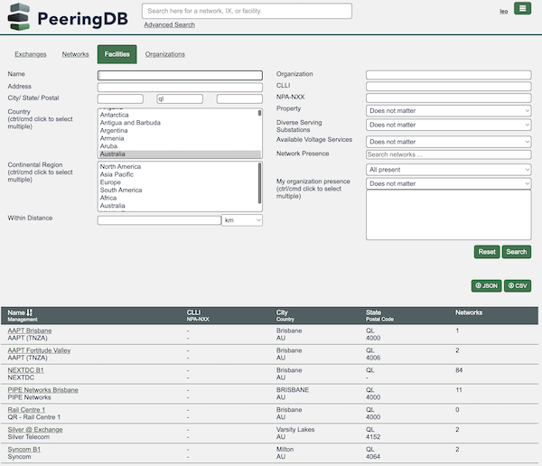
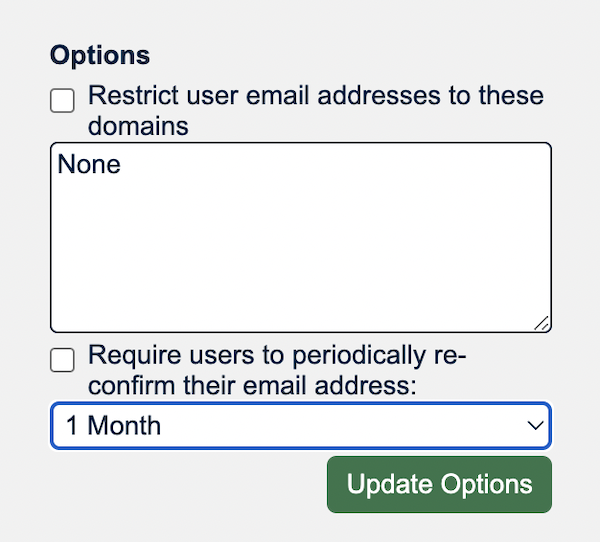
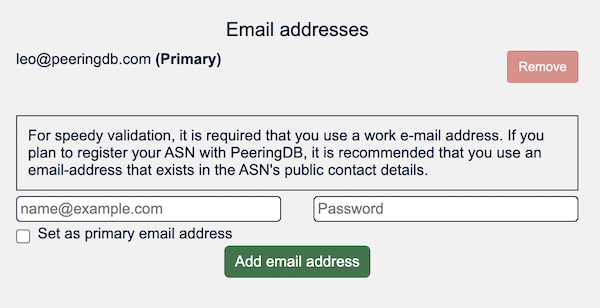
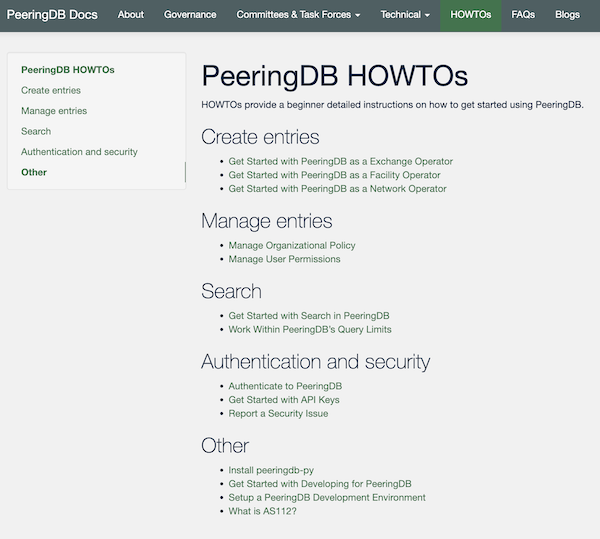

# PeeringDB 2022 Product Report

Data quality and search were ranked most important by respondents to our last three user surveys. This update looks at improvements we have made to keep data quality high by improving automation, giving users better tools, and making it easier to find and export data in PeeringDB.

How to sum up what PeeringDB delivered for its users in 2022? Let's start with some numbers that help describe the scale of the work we’ve done.

This year, we put out 10 major releases resolving over 100 issues. These included:

* Search and export improvements
* Continued improvements to support for [IX-F Member Export](https://github.com/euro-ix/json-schemas)
* Better tools to [support organizational admins](https://docs.peeringdb.com/blog/organizational_policy/)
* 10 more [HOWTO documents](https://docs.peeringdb.com/howtos/)

We got contributions from a number of community members, including engineers at Amazon and Google.

## Search

We normalised the names of states and provinces to improve search results. This builds on the improvements to advanced search deployed in 2021, which allow users to drill down to get very specific information and export in structured formats.

## Managing your organization

We improved the way organizational admins can manage their users. Features include the ability to require affiliated users to enable Multi Factor Authentication using authenticator apps or a hardware token, or use a particular email domain.

## Automation

We [implemented a process](https://docs.peeringdb.com/blog/data_quality_improvements/) to ensure that old networks are removed from PeeringDB when the RIRs or NIRs deregister their AS Numbers. In combination with regular improvements to our support for the IX-F Member Export Schema, we are ensuring that PeeringDB’s data remains fresh.

## Operations

We built on last year’s improvements to API Key support. We introduced query throttling with authenticated users getting more queries. We also worked with developers of third-party tools that query PeeringDB so that they make efficient queries.

We want users to have the best experience they can. So we teamed up with members of the community at the NANOG 86 Hackathon to install our local cache, [peeringdb-py](https://github.com/peeringdb/peeringdb-py), on a wide range of systems. Having tested that we have [documented the installation process](https://docs.peeringdb.com/howto/peeringdb-py/) to make it easier for users to sync PeeringDB to their own infrastructure.

## Documentation

Last year we introduced [our HOWTO series](https://docs.peeringdb.com/howtos/). This year we expanded it and have had to organise it into five sections. We probably have an explanation of how to do what you want. If there’s something missing, then please let us know.

## User support

Sometimes users need support. We’ve improved lots of support tools, so we can help users more quickly and effectively. On average, tickets are resolved in under eight hours, with automation managing 40% of this workload.

## What’s Coming Next?

Two major improvements scheduled for early 2023 include further improvements to search, and translation for anonymous web users. We’ll publish a more detailed product roadmap towards the end of January.

--- 

The improvements we make are only as good as the requests we get from you. We want to make sure that we understand what you need and why. If you have an idea to improve PeeringDB you can share it on our low traffic [mailing lists](/#mailing-lists) or create an issue directly on [GitHub](https://github.com/peeringdb/peeringdb/issues). If you find a data quality issue, please let us know at [support@peeringdb.com](mailto:support@peeringdb.com).

PeeringDB is a freely available, user-maintained, database of networks, and the go-to location for interconnection data. The database facilitates the global interconnection of networks at Internet Exchange Points (IXPs), data centers, and other interconnection facilities, and is the first stop in making interconnection decisions.
