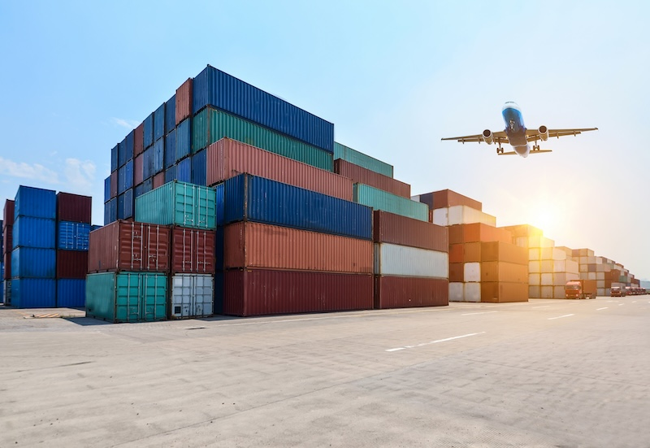

# Putting PeeringDB on ECS/Fargate

We deployed beta.peeringdb.com on Amazon's [ECS/Fargate](https://docs.aws.amazon.com/AmazonECS/latest/developerguide/AWS_Fargate.html) in [release 2.59.0](https://docs.peeringdb.com/release_notes/#release-2590). We'll be deploying www.peeringdb.com on it when we deploy 2.60.0 in July 2024.

<a href="https://www.freepik.com/free-photo/industrial-port-container-yard_1145654.htm#fromView=search&page=1&position=0&uuid=f0a4aff4-0b55-47b6-ad40-636aa1eb2f06">Image by onlyyouqj on Freepik</a>

Fargate is a technology for running containers, eliminating the need for virtual machines. PeeringDB 2.0 was originally deployed using virtual machines about ten years ago, but the technology has advanced since then.

By deploying PeeringDB in containers, we will reduce our computing costs and more easily adjust compute resources dynamically based on load. Managing spending is important as PeeringDB is fully funded by [our sponsors](https://www.peeringdb.com/sponsors). 

It should also help us narrow the scope of work for our volunteer Operations Committee.

We have been looking for ways to improve the efficiency of our spending [since 2022](https://github.com/peeringdb/peeringdb/issues/1225). We started looking at ECS/Fargate in [November 2023](https://github.com/peeringdb/peeringdb/issues/1466). This deployment will complete that process. 

If you have an idea to improve PeeringDB you can share it on our [low traffic mailing lists](https://docs.peeringdb.com/#mailing-lists) or create an issue directly on [GitHub](https://github.com/peeringdb/peeringdb/issues/). If you find a data quality issue, please let us know at [support@peeringdb.com](mailto:support@peeringdb.com).

--- 

PeeringDB is a freely available, user-maintained, database of networks, and the go-to location for interconnection data. The database facilitates the global interconnection of networks at Internet Exchange Points (IXPs), data centers, and other interconnection facilities, and is the first stop in making interconnection decisions.