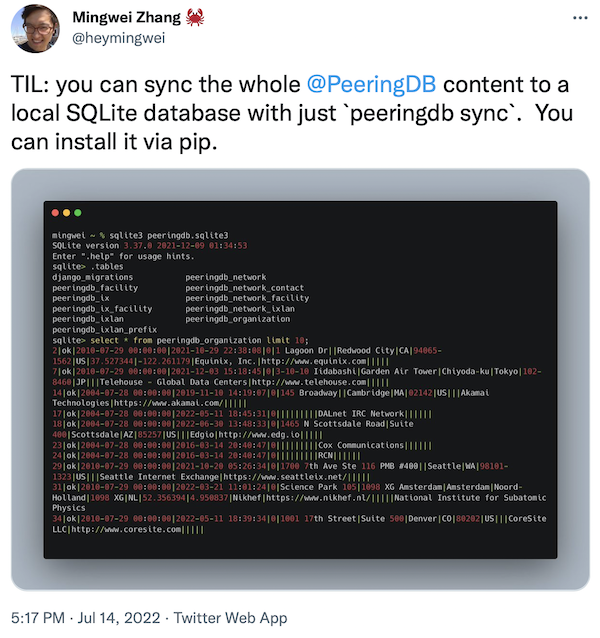

# Faster PeeringDB Queries - No Limits

Did you know that you can have lightning fast access to PeeringDB's database without query limits?

Our web and API services impose query limits. Network latency is sometimes a factor when querying from far away.

That's why we have [peeringdb-py](https://github.com/peeringdb/peeringdb-py/). This is a cache you can run in your own network or even on a laptop. You synchronize the whole database to a machine you run. Once you've done that you are only limited by your own infrastructure.

Re-synchronizing peeringdb-py is efficient - it only syncs changes since the last sync - and is unlikely to trigger any query limits if updated once per hour or less frequently as needed.
 
Are there reasons you should run a local cache other than query limits and latency? Yes.

If you populate internal databases or generate configurations with PeeringDB then a local cache adds reliability. You'll have local access instead of having to rely on intermediate networks.

Of course, peeringdb-py isn't the only choice. Some organizations have developed their own local caches. If you want a local cache you are welcome to use the peeringdb-py codebase as a reference.

And if all you need is to have PeeringDB in a local database, it can be [really simple](https://twitter.com/heymingwei/status/1547737099343781888).

If your organization is a heavy PeeringDB user then work out the right caching approach for you. We’re happy to answer any questions.

If you have an idea to improve PeeringDB you can share it on our low traffic [mailing lists](/#mailing-lists) or create an issue directly on [GitHub](https://github.com/peeringdb/peeringdb/issues). If you find a data quality issue, please let us know at [support@peeringdb.com](mailto:support@peeringdb.com).

--- 

PeeringDB is a freely available, user-maintained, database of networks, and the go-to location for interconnection data. The database facilitates the global interconnection of networks at Internet Exchange Points (IXPs), data centers, and other interconnection facilities, and is the first stop in making interconnection decisions.
