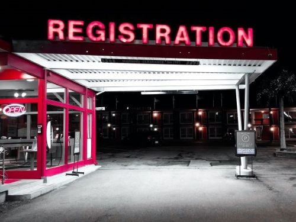

# Guidelines for Registering in PeeringDB

About one third of ASNs are now registered in PeeringDB. While that’s a success it comes with a responsibility to enhance transparency over what is required when registering a network, IXP, or facility in the database.

We have just published a set of [guidelines](committee/admin/approval-guidelines/) that document the criteria our automation uses, or will use when new software is developed. Where we cannot automate, volunteers on our Admin Committee evaluate requests.

There are clear criteria for the automatic, or semi-automatic, approval of each type of object. These are illustrated with flowcharts that show the possible paths through the process. 

## What Are They?

* Networks must have a unique and properly registered ASN.
* IXP LANs must use unique and properly registered address space. There are some automatic prefix limits but these can be manually overridden when needed.
* Facilities can automatically be added by organizations that already have a facility, be validated by a web page offering interconnection services there, or be attested to by users that confirm the facility exists.

There is also a process to remove empty facilities without registered networks or IXPs present in them.  

## Feedback Loop

We know that these guidelines will need to be improved and updated as we learn, so we have built in an “exception” process to help with that. Whenever an easy path is not possible, the requester can ask for more eyes on their registration request. 

The first step in this process is to get input from all the volunteers on the Admin Committee. If more eyes are needed, the request can be shared with all of PeeringDB’s Stewards, a group made from the committee chairs and board members. Where a formal decision is needed, the board can vote on a request and make a final decision.

Each step of this process is an opportunity to learn from experience and feed that back into our published guidelines, our internal processes, and any software that automates them.

So, while we’ve published these today, we’ll be updating them as the interconnection environment changes and we need to adapt to it.

If you have an idea to improve PeeringDB you can share it on our low traffic [mailing lists](https://docs.peeringdb.com/#mailing-lists) or create an issue directly on [GitHub](https://github.com/peeringdb/peeringdb/issues). If you find a data quality issue, please let us know at [support@peeringdb.com](mailto:support@peeringdb.com).

--- 

PeeringDB is a freely available, user-maintained, database of networks, and the go-to location for interconnection data. The database facilitates the global interconnection of networks at Internet Exchange Points (IXPs), data centers, and other interconnection facilities, and is the first stop in making interconnection decisions.
