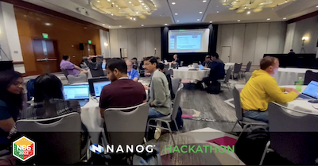

# Installing peeringdb-py at NANOG 86

NANOG 86 participants installed `peeringdb-py` on Linux, macOS, and Windows Subsystem for Linux. We have used what they learned to publish a [new HOWTO document](/howto/peeringdb-py/) to help more users install it.

`peeringdb-py` is our reference implementation of a local cache of our database. You can install it on your own infrastructure. That means you can avoid query limits and get the best response time.

Our new HOWTO document explains when you'll need [an API Key](/howto/api_keys/) and what kind of API Key to create.

It also lists the packages you'll need installed to get `peeringdb-py` up and running. Finally, it provides guidance on how you can automatically refresh the database. We improved the installation guide to help users keep their installation current.

Better documentation makes it easier for everyone to install `peeringdb-py`.

If you need to make a lot of PeeringDB queries then we encourage you to query a local cache. If you do this, you'll want to run API queries against it using our software library. The API will remain stable while the database structure could change. The API will remain stable and our library will ensure you don't need to rewrite your queries.

If you have an idea to improve PeeringDB you can share it on our [low traffic mailing lists](https://docs.peeringdb.com/#mailing-lists) or create an issue directly [on GitHub](https://github.com/peeringdb/peeringdb/issues/). If you find a data quality issue, please let us know at [support@peeringdb.com](mailto:support@peeringdb.com).

--- 

PeeringDB is a freely available, user-maintained, database of networks, and the go-to location for interconnection data. The database facilitates the global interconnection of networks at Internet Exchange Points (IXPs), data centers, and other interconnection facilities, and is the first stop in making interconnection decisions.
