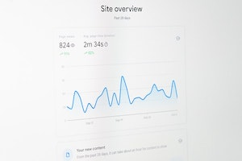

# Introducing Analytics

Until now, we have not had any analytics about PeeringDB usage. This is a problem. It means we can't make informed decisions that will help us deliver a better service to users.

Users have often told us that they want improvements to the website. We know what some of these are but not all. Introducing analytics will help us learn more about the problems some users face. We can then develop improvements to meet their needs.

The Product Committee [has decided](/committee/product/notes/2022-10-17_Product_Committee_Notes.pdf) to test Google Analytics. The first step is to deploy it on beta.peeringdb.com. We'll use this as a learning experience. When we are happy with the analytics, we want to deploy an analytics service on www.peeringdb.com.

## What's next?

We know that analytics only provides some of the information we need. We are developing plans to help users give more timely and targeted feedback. We can use that feedback to design and implement the improvements that will be most valuable to users.

If you have an idea to improve PeeringDB you can share it on our low traffic mailing lists or create an issue directly on [GitHub](https://github.com/peeringdb/peeringdb/issues). If you find a data quality issue, please let us know at [support@peeringdb.com](mailto:support@peeringdb.com). 

--- 

PeeringDB is a freely available, user-maintained, database of networks, and the go-to location for interconnection data. The database facilitates the global interconnection of networks at Internet Exchange Points (IXPs), data centers, and other interconnection facilities, and is the first stop in making interconnection decisions. 
