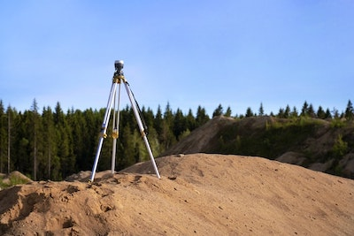

# PeeringDB 2022 User Survey

PeeringDB wants input from everyone who uses our interconnection database. Our [anonymous survey](https://surveyhero.com/c/pdb22blog) is now open until 23:59 UTC on 16 October 2022. We would like your feedback to help us make PeeringDB more useful to everyone involved in connecting networks.

We had about 250 responses to last year’s survey which helped guide our product development. Key changes delivered so far in 2022 include:

* Added API Key support to [`peeringdb-py`](https://peeringdb.github.io/peeringdb-py/)
* Added FIDO U2F 2FA support to www.peeringdb.com
* Normalized place names

We’ve also published more documents in our [HOWTO documentation series](https://docs.peeringdb.com/howtos/). 

Steve McManus, PeeringDB Product Committee Chair, says: "*The 2021 survey helped us focus development where it was most needed. We used it to develop our roadmap. We are still implementing things we have learned from previous surveys but want your input on how we should adapt. Please take a few moments of their time to help us make PeeringDB a better service!*”

In 2022 we have added a couple of extra questions. We'd like to know how many people use PeeringDB at your organization. We'd also like to know how you use it: web, API, or via a local cache. We will use your answers to focus development work where it is most needed.

The survey is available in the six UN languages, Portuguese and Ukrainian. Please provide comments in whatever language you want to express yourself.

We’ll share the results and the new product roadmap early in 2023.

So [CLICK HERE](https://surveyhero.com/c/pdb22blog) to help guide PeeringDB’s future development.

If you have an idea to improve PeeringDB you can share it on our low traffic mailing lists or create an issue directly on GitHub. If you find a data quality issue, please let us know at [support@peeringdb.com](mailto:support@peeringdb.com).

--- 

PeeringDB is a freely available, user-maintained, database of networks, and the go-to location for interconnection data. The database facilitates the global interconnection of networks at Internet Exchange Points (IXPs), data centers, and other interconnection facilities, and is the first stop in making interconnection decisions.
