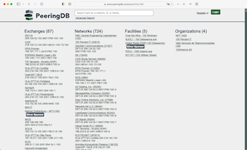
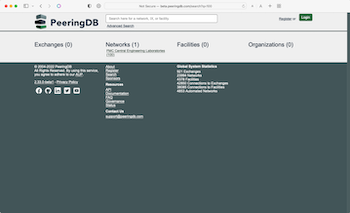

# PeeringDB is Developed by its Community
PeeringDB community members have contributed two significant improvements that were deployed into production this month.

## Simple Search is Smarter Search
As [reported by NANOG](https://nanog.org/stories/hackathon-solves-real-world-tech-issue/) last week, code developed by Brad Schwyzer, James Lamanna, and Jeff Kala developed code that significantly improves the accuracy of what we call Simple Search. This is the main search box on the front page or the basic API call. Until this month it provided an enthusiastic number of responses when searching for things like small AS Numbers. 

While the answers weren’t wrong, our users needed to pay extra attention to find what they needed. Brad, James, and Jeff developed logic to work out what users are likely to be searching for and give them the most relevant results. Simple Search now knows about the difference between an AS Number, an IPv4 address, and an IPv6 address. It will only respond with IP address information if at least two segments of the address are included in the search.

They turned this: 

Into this:

We are grateful to them and to NANOG, who hosted the Hackathon where this code was developed. We are keen to participate in more Hackathons in the future.

## OpenID Connect
We also deployed code developed by Carlos Aguado to implement [OpenID Connect](https://github.com/peeringdb/peeringdb/issues/1070). This builds on our existing support for OAuth to enable identity federation with managed services. The code Carlos developed means that PeeringDB can be used as an OpenID Authorization Server so that any PeeringDB user can sign in to other websites.

## Your Code

If you are a software developer who needs something from PeeringDB we might be able to deploy code you develop. We have a tested [development environment](https://docs.peeringdb.com/blog/contributing_code/) and are keen to make PeeringDB service the interconnection community’s needs. So please create an [issue on GitHub](https://github.com/peeringdb/peeringdb/issues/new/choose) or let us know at [support@peeringdb.com](mailto:support@peeringdb.com).

---

PeeringDB is a freely available, user-maintained, database of networks, and the go-to location for interconnection data. The database facilitates the global interconnection of networks at Internet Exchange Points (IXPs), data centers, and other interconnection facilities, and is the first stop in making interconnection decisions. 
