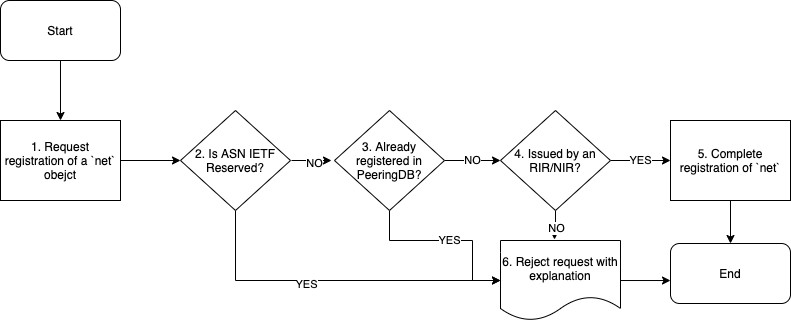
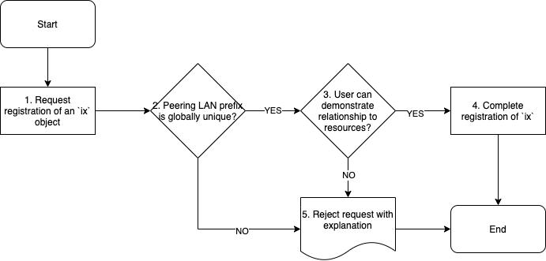
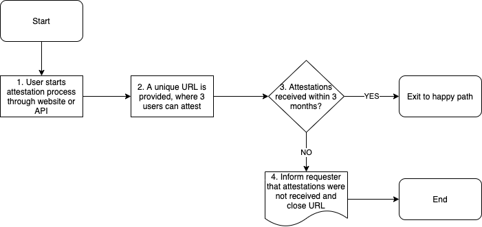
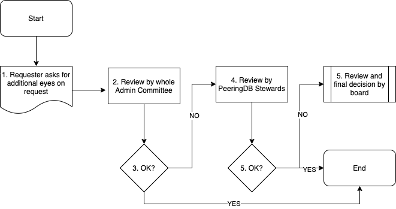

# Admin Committee Guidelines and Criteria for Approving Networks, IXPs, and Facilities

## Authors

* Chris Malayter
* Arnold Nipper
* Job Snijders

## Document history

* v1. Initial document.
* v2. Added multiple mechanisms to validate IXP and Network.
* v3. Added mechanism to validate facility.
* v4. Added draft flowcharts and placed explanatory text in an appendix. Minor readability revisions.

## Guideline goals

This guide does not seek to define what an Internet Exchange, or Network operator, or Facility is. PeeringDB is a registry of information. What people do with the information is up to them. In these guidelines, we attempt to merely document PeeringDB’s approval process. Key goals include:

* The Admin Committee can use multiple to validate and facilitate the creation of objects.
* Workflows are shown and always include the option to fall back to an exception process. This process brings more eyes and helps PeeringDB identify areas for improvement.
* Provide a few tangible examples of how to apply the guidelines.

## Definitions

* User - a person submitting a new object to the PeeringDB database
* RIR - A Regional Internet Registry (AFRINIC, APNIC, ARIN, LACNIC or the RIPE NCC)
* NIR - A National Internet Registry recognized by one of the RIRs

Additional terminology is described in Section 4 of the [PeeringDB Data Ownership Policy Document](/gov/misc/2020-04-06_PeeringDB_Data_Ownership_Policy_Document_v1.0.pdf).

## Approving Network (`net`) objects

The key to approving Network objects is to confirm the User has a relationship to the specified Autonomous System Number (ASN) and is authorized to represent that ASN in some form.

PeeringDB follows industry best practices and has the following requirements for the Autonomous System numbers, regardless of who the User is:

* ASNs must be registered through an RIR or NIR
* The ASN must not already be registered in PeeringDB

This means that “Private” ASNs, as listed in the [IANA Autonomous System (AS) Numbers Registry](https://www.iana.org/assignments/as-numbers/) or “Bogon” ASNs, those which have not yet been assigned by an RIR or NIR, cannot be registered in PeeringDB.

### Flowchart

There are various mechanisms to verify the relationship between the User and a given Autonomous System number:

* The registration details listed in WHOIS match the registration details in the sign-up request (same email domain)
* The registration details listed in RDAP match the registration details in the sign-up request (same email domain)
* The user can confirm the relationship to the ASN through a RPKI based challenge/response (work in progress: draft-ietf-sidrops-rpki-rsc)
* The user can confirm the relationship to the ASN by entering a PeeringDB suggested random string in their WHOIS record in a comments/remarks field (not yet implemented, a similar strategy to how Amazon AWS does BYOIP)
* [Exception approval](/committee/admin/approval-guidelines/#exception-process) follows the standard process 

PeeringDB encourages but does not require its users to follow industry best practices. This means we recommend: 

* Making a BGP looking glass publicly available, or 
* A website listing the Network services, and a publicly documented Routing Policy

## Approving IXP (`ix`) objects

The key to approving IXP objects is to confirm the User has a relationship to the specified Peering LAN Prefix, and is authorized to represent this IP block in some form.

### Flowchart

### Globally unique IP prefix requirements

* IP prefix must be registered through an RIR or NIR.
* The prefix must not overlap with any existing IXP object in PeeringDB
* IPv4 prefixes must not be longer than a /27 or shorter than /19
* IPv6 prefixes must not be shorter than /64 but may be longer i.e. a /120 is allowed but a /63 is not

Users can verify their relationship to an IP prefix in several ways:

* The registration details listed in WHOIS match the registration details in the sign-up request (same email domain).
* The registration details listed in RDAP match the registration details in the sign-up request (same email domain).
* The user can confirm the relationship to the IP prefix through a RPKI based challenge/response (work in progress - draft-ietf-sidrops-rpki-rsc).
* The user can confirm the relationship to the IP prefix by entering a PeeringDB suggested random string in their inetnum record in the authoritative RIR or NIR database in a comments/remarks field (note: IRR route/route6 objects cannot be used for this purpose). RDAP should be used to discover which RIR or NIR is authoritative
* For Legacy IPv4 space, a PeeringDB suggested random string can be placed in a TXT record for the reverse DNS label representing the first IPv4 address in the prefix. (This is a variant of the Amazon AWS BYOIP process). The assumption is that if someone controls Reverse DNS for a given prefix, they have full control over the prefix. 
* [Exception approval](/committee/admin/approval-guidelines/#exception-process) follows the standard process 

PeeringDB encourages but does not require its users to follow industry best practices. This means we recommend: 

* A website detailing the IXP service
* A public overview of connected members and locations, service level, and terms of membership.

## Approving Facility (`fac`) objects

A “facility” is a physical location where two or more IP Networks or IXPs interconnect with each other. The key to approving Facility objects is to confirm with multiple existing PeeringDB users that a facility exists. 

* Note: We will need to extend PeeringDB's software to support the workflow described here.
* Note: The IP addresses used in the attestation process will be logged.

### Validation mechanisms

The owner of the facility is an existing PeeringDB user, and adds the facility to their record themselves. In this approval flow the facility is ‘claimed’. For this workflow the facility owner should already have one facility previously validated via one of the following mechanisms:

* The owner of the facility is not a PeeringDB user, but interested parties (who are PeeringDB users) wish the Facility object to be registered. The result is an unclaimed Facility object.
* The building has a website that has an interconnection or colocation section or
One user will suggest the facility (peeringdb.com/suggest/fac), after filling in the details the form will generate a unique URL where the attestations can be collected. The user then distributes the URL (which can only be accessed by logged-in users) to the other interested parties, who can then attest or disprove the facility. When 3 PeeringDB users positively attest the facility exists, the facility is approved.
* The owner of the facility is a new peeringdb user and does not have any objects associated with their account. There are two mechanisms to claim a Facility object.
* The building has a website that has an interconnection or colocation section or
An attestation process similar to how new facilities are suggested by existing users is followed, where the attempting-to-claim PeeringDB user must collect 3 positive attestations from three existing PeeringDB users. 
* [Exception approval](/committee/admin/approval-guidelines/#exception-process) follows the standard process 

### Flowchart - Facility

### Flowchart - Attestation

### Flagging as "junk"

PeeringDB users can flag a facility as “junk”. This puts the Facility object in a review queue. The Admin Committee can resolve in the following ways:

* The facility owner becomes a PeeringDB user and claims the facility.
* The 3 people who attested that the facility exists can point at two existing PeeringDB IXP or Network object owners who are willing to attest they are present in the facility.
* The Admin Committee contacts the IXP or Network object owners and asks them to confirm their presence in the facility. At this point the facility record will list at least two network and/or IXP objects.

A facility without networks or IXPs is considered potential “junk”. 

Empty facilities will be deleted after 90 days. This happens when neither the owner of the facility, nor any other PeeringDB users were willing to indicate a relationship to the facility. The “junk” button only appears in the UI for objects which are both unclaimed, and where no networks or IXPs indicate a presence.

#### Checklist to help find entities present at the facility and or understand who the facility owner is

* Website operated by the facility owner: recommended and SHOULD list colocation or interconnection as a service
* Government or Industry Association website listing facilities. (Example: CLLI locators in the United States)
* Website of IXPs or Networks publishing they operate in the building

### Example facility object approval scenarios

#### Facility approval example 1

Facility located at 100 W Main Street, Nowhere, WV, USA. Facility has four ISPs that interconnect in the basement of the building. Three out of the four ISPs have staff with PeeringDB accounts. Building owner has provided a closet for this to occur. Building has no website, the building owner does not know anything about interconnection, and has no plans to market the building as an interconnection location.

*Start*

ISP operator A files a request to suggest a Facility object to be entered into PeeringDB.

*Validation Process*

The facility owner is not a PeeringDB user, so the mechanism of the facility owner themselves suggesting the facility cannot be applied. The act of suggesting the facility in the PeeringDB user interface generates a unique URL which ISP Operator A can share with the fellow ISPs. If at least 2 other PeeringDB users attest the facility exists, the Facility object is created and marked as “unclaimed”.

#### Facility approval example 2

A PeeringDB user noticed the Facility object created (as a result of Example 1), and reports it as “junk”. The object continues to exist, but is added to a review queue for the PeeringDB Admin Committee to help resolve the situation. The Admin Committee’s task is to find positive proof the facility exists and interconnection happens.

*Validation Process*

The AC committee first contacts the original PeeringDB users that provided attestations the facility exists. (Note: these PeeringDB users themselves might not be present in the facility).

The AC can request the original attesters to provide a list of ISPs or IXPs they think are present in the facility. The AC can then contact the ISPs and/or IXPs who were suggested to have a presence in the facility and ask them to either attest the facility exists, or to add themselves as ‘present’ in the facility. It is possible these ISPs and/or IXPs are not yet PeeringDB users.

If the AC can’t collect the attestations the facility will be deleted in 90 days.

#### Facility approval example 3

A Facility owner is a PeeringDB user and wishes to add its facility to PeeringDB using the “Suggest a Facility” function. The building owner is leasing suites to carriers in the basement of his facility, but primarily focuses on leasing office space. The building has a webpage, but data center/interconnection services are not listed on the webpage. The building owner has provided a list of four carriers who have leased space in the building. 

*Validation Process*

The building owner can add webpage showing that they provide interconnection 
services. 

The attestation process can be used to demonstrate the building is used for interconnection. 

#### Facility approval example 4

An existing facility operator with other facilities listed in PeeringDB submits a new facility that does not yet have any customers. 

*Validation Process*

None - The facility should be immediately added.

After the Facility object has been added, networks and IXPs can indicate their presence.

## Exception process
We know that these guidelines will need to be improved and updated as we learn, so we have built in an “exception” process to help with that. Whenever an easy path is not possible, the requester can ask for more review of their registration request. 

The first step in this process is to get input from all the volunteers on the Admin Committee. If more eyes are needed, the request can be shared with all of PeeringDB’s Stewards, a group made from the committee chairs and board members. Where a formal decision is needed, the board can vote on a request and make a final decision.

### Flowchart

## Appendix

#### Why must peering LANs be between /27 and /19 (IPv4) and not shorter than /64 (IPv6)?

This limit is intended to reduce the likelihood of a typo that goes undetected and causes operational issues. Where a peering LAN uses a /28 or a /18 (IPv4) the Admin Committee can manually process the prefix after verifying its prefix length is correct.

The technical standards do not allow LANs to have prefixes shorter than a /64, so a /63 would be rejected to avoid causing operational issues to operator equipment that is standards compliant.
